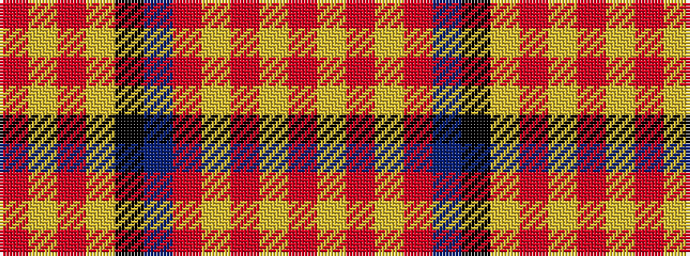

RYRYKBRYRYR

It is a 11 stripe tartan.

<figure class="pat-woven">

<figcaption>idealised sample</figcaption>
</figure>

## Colour Sequence



## Tartans with this colour sequence

| Tartans |
|---------------|
| [Dabney Grey (Personal)](/variants/s11/r2lr2r1lr24o1n3k3lr3o12lr4r1~x2/)|
||
