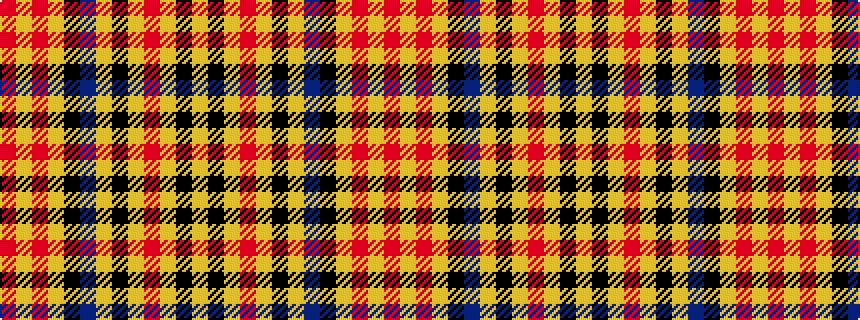

RYRYKBYKYRYKY

It is a 13 stripe tartan.

<figure class="pat-woven">

<figcaption>idealised sample</figcaption>
</figure>

## Colour Sequence



## Tartans with this colour sequence

| Tartans |
|---------------|
| [Aboyne](/variants/s13/lo12k1lo1r28lo4k8lr1do11k8lo32r11lo6r4~x2/)|
||
