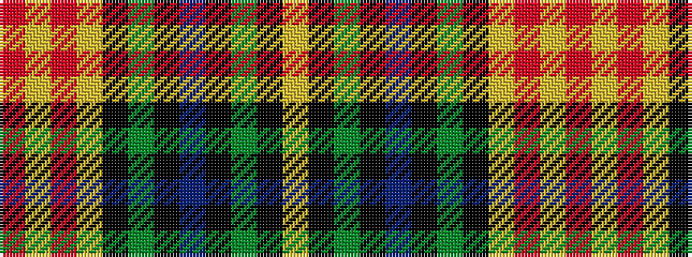

RYRYKGKBKGKY

It is a 12 stripe tartan.

<figure class="pat-woven">

<figcaption>idealised sample</figcaption>
</figure>

## Colour Sequence



## Tartans with this colour sequence

| Tartans |
|---------------|
| [Trinity Presbyterian Church (Corpora](/setts/s12/r3lr3r3lr12k6y3k4db16k4y3k6lr3~x2/)|
||
