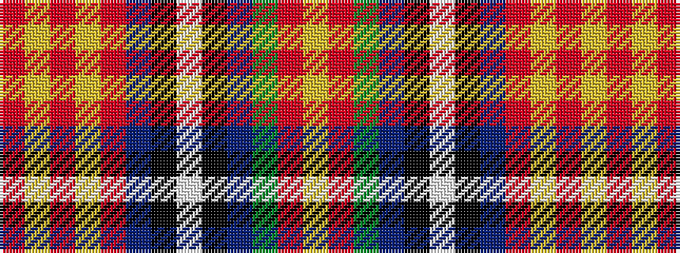

RYRYRBKWKBGRY

It is a 13 stripe tartan.

<figure class="pat-woven">

<figcaption>idealised sample</figcaption>
</figure>

## Colour Sequence



## Tartans with this colour sequence

| Tartans |
|---------------|
| [Sri Lanka](/variants/s13/lo18r3g30b4k2w2k2b4r37ly1r3ly1r3~x2/)|
||
