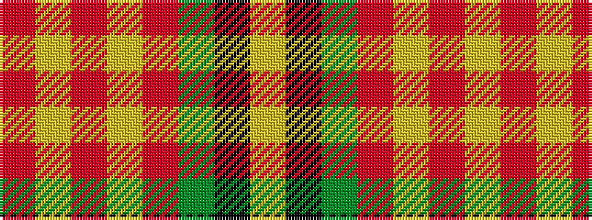

RYRYRGKY

It is a 8 stripe tartan.

<figure class="pat-woven">

<figcaption>idealised sample</figcaption>
</figure>

## Colour Sequence



## Tartans with this colour sequence

| Tartans |
|---------------|
| [Botherston (Name)](/setts/s8/r2lo24r2lo3r2g24k8ly2~x2/)|
||
