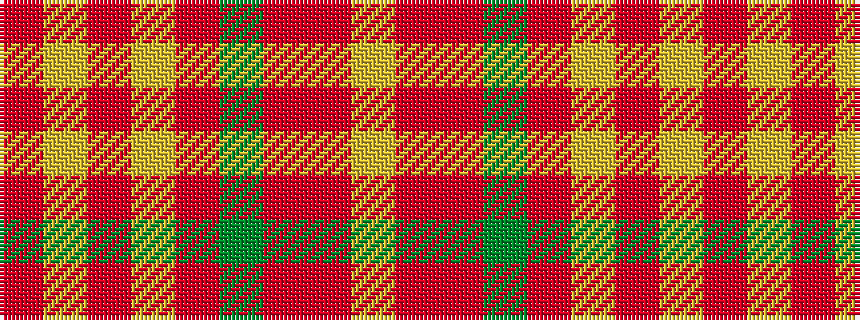

RYRYRGRRY

It is a 9 stripe tartan.

<figure class="pat-woven">

<figcaption>idealised sample</figcaption>
</figure>

## Colour Sequence



## Tartans with this colour sequence

| Tartans |
|---------------|
| [Montreal Granate](/setts/s9/lo78r10r1g2r6lo2r3lo2r43~x2/)|
||
