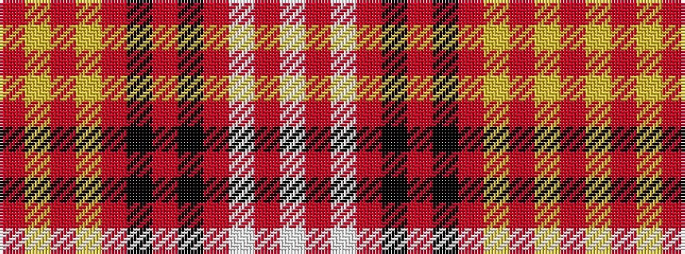

RYRYRKRKRWRW

It is a 12 stripe tartan.

<figure class="pat-woven">

<figcaption>idealised sample</figcaption>
</figure>

## Colour Sequence



## Tartans with this colour sequence

| Tartans |
|---------------|
| [Manchester Reds](/setts/s12/r36ly4r1ly4r4k8r4k2r4w2r1w4~x2/)|
||
