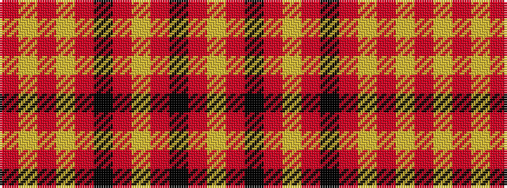

RYRYRKRYRKRY

It is a 12 stripe tartan.

<figure class="pat-woven">

<figcaption>idealised sample</figcaption>
</figure>

## Colour Sequence



## Tartans with this colour sequence

| Tartans |
|---------------|
| [Highland Queen](/setts/s12/r8lg4r30lr6r2k1r2lg6r8k1r4ly2~x2/)|
||
