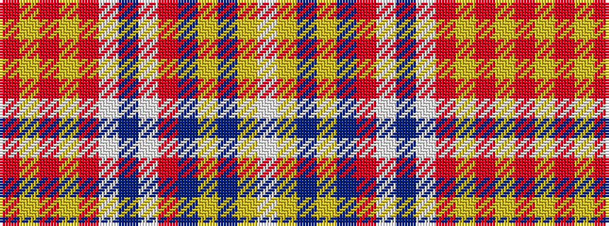

RYRYRWBWRBYBYW

It is a 14 stripe tartan.

<figure class="pat-woven">

<figcaption>idealised sample</figcaption>
</figure>

## Colour Sequence



## Tartans with this colour sequence

| Tartans |
|---------------|
| [San Francisco](/setts/s14/r4lo4r1lo2r24w2db4w2r4db2lo18db2lo1w4~x2/)|
||
