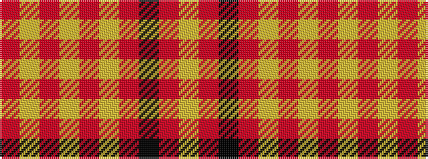

RYRYRYRKRY

It is a 10 stripe tartan.

<figure class="pat-woven">

<figcaption>idealised sample</figcaption>
</figure>

## Colour Sequence



## Tartans with this colour sequence

| Tartans |
|---------------|
| [Austin College Page](/setts/s10/r3ly2r2ly3r3ly7r3k7r14ly2~x2/)|
||
