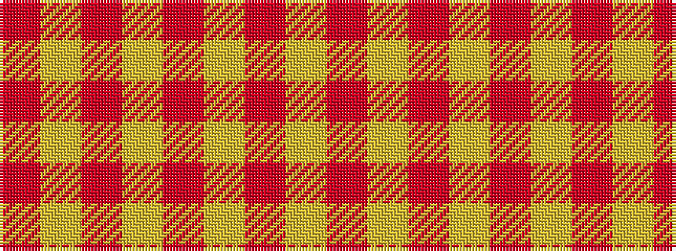

RYRYRYRY

It is a 8 stripe tartan.

<figure class="pat-woven">

<figcaption>idealised sample</figcaption>
</figure>

## Colour Sequence



## Tartans with this colour sequence

| Tartans |
|---------------|
| [Masai Shuka 09 (Artefact)](/setts/s8/o60lo15o4lo2o2lo2o2lo2~x2/)|
||
| [Menzies Dress](/setts/s8/r36lr4r3lr4r6lr2r1lr12~x2/)|
||
| [Menzies Dress](/setts/s8/r36lr4r3lr4r6lr2r1lr12/)|
||
