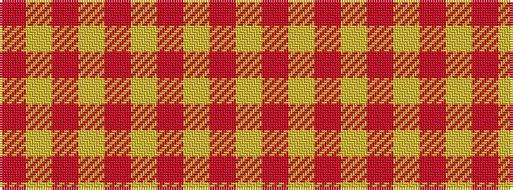

RYRYRYRYR

It is a 9 stripe tartan.

<figure class="pat-woven">

<figcaption>idealised sample</figcaption>
</figure>

## Colour Sequence



## Tartans with this colour sequence

| Tartans |
|---------------|
| [MacMillan](/variants/s9/r3ly1r12ly2r3ly8r2ly8r1~x2/)|
||
| [MacMillan - 1842 (Dress)](/variants/s9/r3ly2r12ly2r3ly8r2ly8r2~x2/)|
||
| [MacMillan Dress Clan Tartan](/variants/s9/r6ly2r18ly3r4ly12r3ly10r2~x2/)|
||
