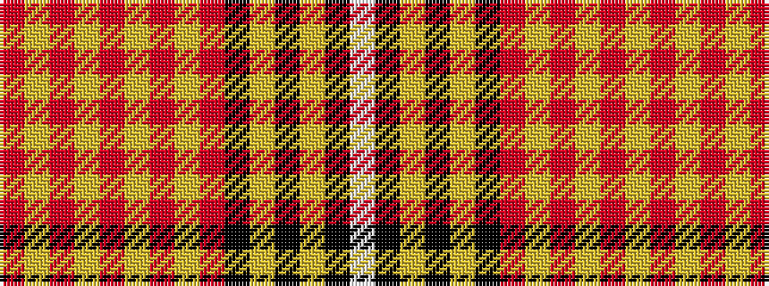

RYRYRYRYRKYKYKW

It is a 15 stripe tartan.

<figure class="pat-woven">

<figcaption>idealised sample</figcaption>
</figure>

## Colour Sequence



## Tartans with this colour sequence

| Tartans |
|---------------|
| [Moir (Loch Insh) (Personal)](/setts/s15/r31lg3r2lg2r3lg2r2lg3r15k15lg2k15lg3k3w2~x2/)|
||
