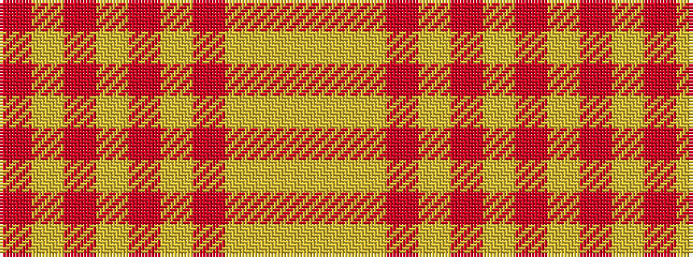

RYRYRYRYYY

It is a 10 stripe tartan.

<figure class="pat-woven">

<figcaption>idealised sample</figcaption>
</figure>

## Colour Sequence



## Tartans with this colour sequence

| Tartans |
|---------------|
| [Golden Heather, The](/setts/s10/r2ly20o2ly2r3lo3r3lo6lo24ly2~x2/)|
||
