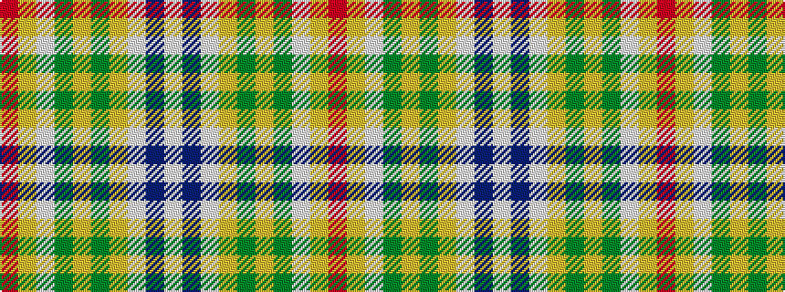

RYWGYGYWBW

It is a 10 stripe tartan.

<figure class="pat-woven">

<figcaption>idealised sample</figcaption>
</figure>

## Colour Sequence



## Tartans with this colour sequence

| Tartans |
|---------------|
| [State Seal of Delaware (Fashion)](/variants/s10/lb38dt18lb4ly3g10lo3g4lb3lo17r4~x2/)|
||
