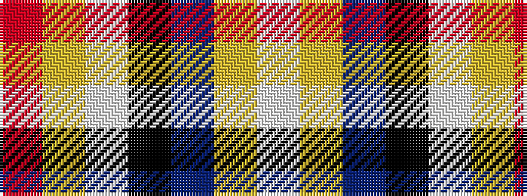

RYWKBYW

It is a 7 stripe tartan.

<figure class="pat-woven">

<figcaption>idealised sample</figcaption>
</figure>

## Colour Sequence



## Tartans with this colour sequence

| Tartans |
|---------------|
| [Lachine Historic](/variants/s7/w13lg13t13k10w7ly1r1~x4/)|
||
