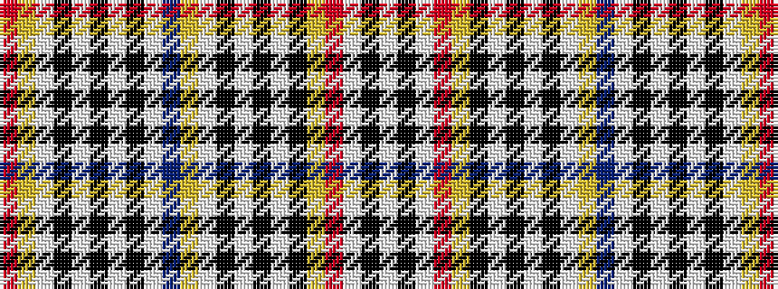

RYWKWKWKWBYWKWKWKYRWKW

It is a 22 stripe tartan.

<figure class="pat-woven">

<figcaption>idealised sample</figcaption>
</figure>

## Colour Sequence



## Tartans with this colour sequence

| Tartans |
|---------------|
| [Normandy Bay Myth (Fashion)](/variants/s22/w2k1w1r1ly1k3w18k2w2k1w1ly2t8w4k48w3k2w2k1w1ly1r1~x2/)|
||
