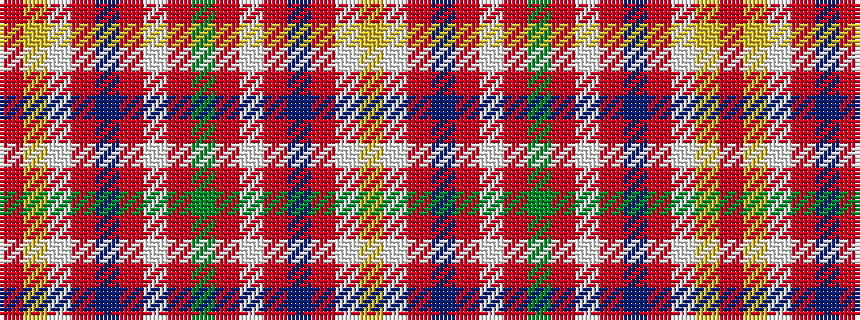

RYWRBRWRGRWRBRWY

It is a 16 stripe tartan.

<figure class="pat-woven">

<figcaption>idealised sample</figcaption>
</figure>

## Colour Sequence



## Tartans with this colour sequence

| Tartans |
|---------------|
| [Unidentified Scarlett #10](/setts/s16/g28r2lb2r18db9r9lb9ly1r3~x2/)|
||
