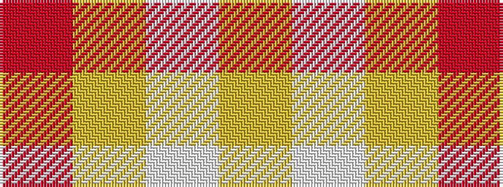

RYWY

It is a 4 stripe tartan.

<figure class="pat-woven">

<figcaption>idealised sample</figcaption>
</figure>

## Colour Sequence



## Tartans with this colour sequence

| Tartans |
|---------------|
| [One Account (Corporate)](/variants/s4/ly6w5ly12r2~x2/)|
||
| [Virgin One (Corporate)](/variants/s4/lo7w6lo11r2~x2/)|
||
