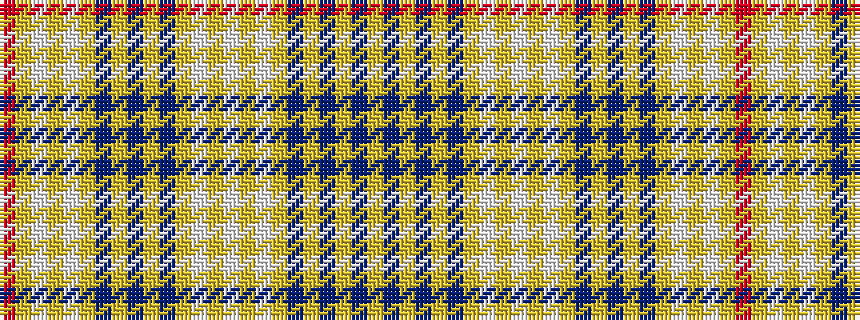

RYWYWYBYBYBYWYWYWYBYBYBY

It is a 24 stripe tartan.

<figure class="pat-woven">

<figcaption>idealised sample</figcaption>
</figure>

## Colour Sequence



## Tartans with this colour sequence

| Tartans |
|---------------|
| [Ottawa (District)](/setts/s24/lo7b4lo1b4lo1b4lo7w2lo6w1lo1w1lo1db2lo1db3lo1db2lo1w1lo1w1lo6r1~x4/)|
||
| [Ottawa District Tartan Tartan Number: 2021. Earliest known date: 1966 In two blocks - Navy Block ends on 14th colour change Gold 24. Azure Block starts on the following White 8. The design was accepted as the Official Tartan of Ottawa by order of the Council on November 21st 1966. In 1985 it was no longer in commercial production. See products available Copyright © Blair Urquhart, Comrie, 2015](/setts/s24/ly7t4ly1t4ly1t4ly7w2ly6w1ly1w1ly1db2ly1db3ly1db2ly1w1ly1w1ly6r1~x4/)|
||
