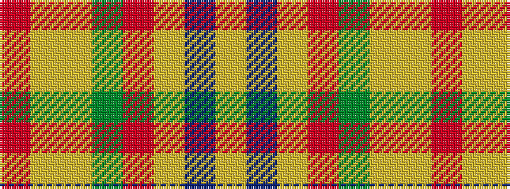

RYYGRYBY

It is a 8 stripe tartan.

<figure class="pat-woven">

<figcaption>idealised sample</figcaption>
</figure>

## Colour Sequence



## Tartans with this colour sequence

| Tartans |
|---------------|
| [Miller Hargreaves (Personal)](/setts/s8/lr40t4lr4m5y5lr3ly6r3~x2/)|
||
