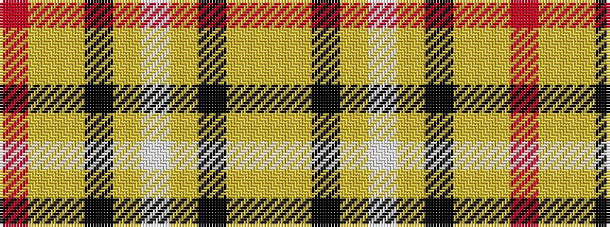

RYYKYWYKYY

It is a 10 stripe tartan.

<figure class="pat-woven">

<figcaption>idealised sample</figcaption>
</figure>

## Colour Sequence



## Tartans with this colour sequence

| Tartans |
|---------------|
| [Irving of Glentulchan (Personal)](/variants/s10/lg9lr9k1lr1w1lr1k1lr9lg9r1~x6/)|
||
