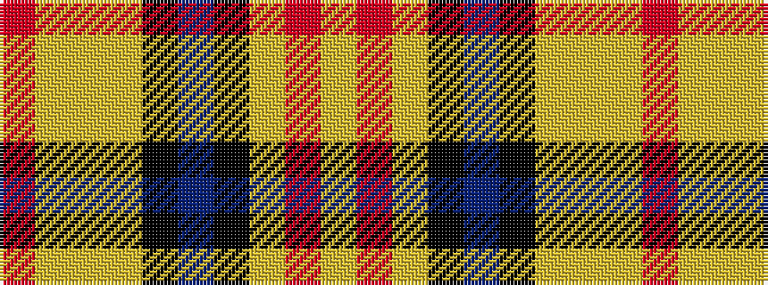

RYYYKBKYRY

It is a 10 stripe tartan.

<figure class="pat-woven">

<figcaption>idealised sample</figcaption>
</figure>

## Colour Sequence



## Tartans with this colour sequence

| Tartans |
|---------------|
| [VeMMA](/setts/s10/r24lr2lr7lr3k2n4k2lr1r4lr1~x2/)|
||
