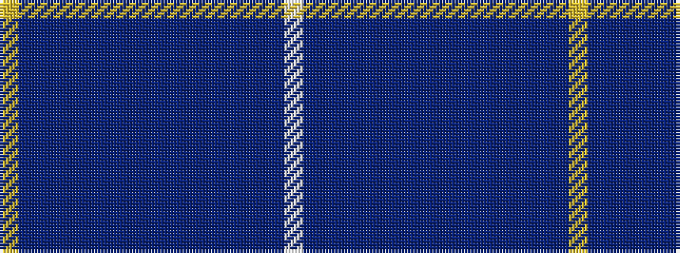

WBBBBBBBBBBBBBBY

It is a 16 stripe tartan.

<figure class="pat-woven">

<figcaption>idealised sample</figcaption>
</figure>

## Colour Sequence



## Tartans with this colour sequence

| Tartans |
|---------------|
| [Ryder Cup 2014 (Corporate)](/setts/s16/w3db21db8t1db4t1db3t2db2t2db1t3db1t12db5ly3~x2/)|
||
