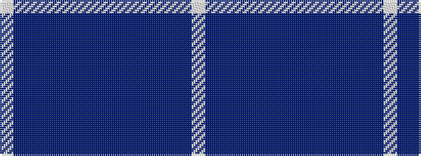

WBBBBBBBBBBBBBW

It is a 15 stripe tartan.

<figure class="pat-woven">

<figcaption>idealised sample</figcaption>
</figure>

## Colour Sequence



## Tartans with this colour sequence

| Tartans |
|---------------|
| [Ferring Pharmaceuticals](/setts/s15/lb6b2db4db12b48db8b8t10b9db8b24db8b6db4lb4~x2/)|
||
