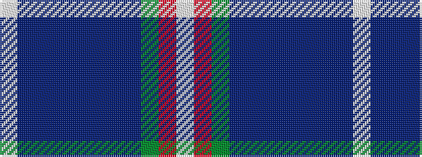

WBBBBBBBGRW

It is a 11 stripe tartan.

<figure class="pat-woven">

<figcaption>idealised sample</figcaption>
</figure>

## Colour Sequence



## Tartans with this colour sequence

| Tartans |
|---------------|
| [Inverclyde (Corporate)](/setts/s11/w3db5dbi2db9n10t2n4t2g10r33w2~x2/)|
||
