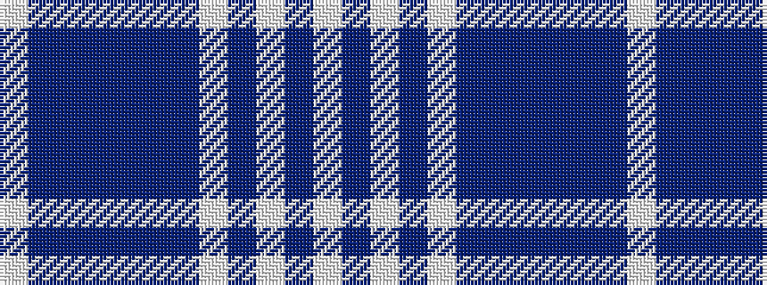

WBBBBBBWBWBW

It is a 12 stripe tartan.

<figure class="pat-woven">

<figcaption>idealised sample</figcaption>
</figure>

## Colour Sequence



## Tartans with this colour sequence

| Tartans |
|---------------|
| [Menzies Dress Blue & White](/variants/s12/w4t1w2t3w23db5t3db1t1db1t19w2~x2/)|
||
| [Menzies Royal Blue Dress Tartan](/variants/s12/w4db1w2db3w24t5db3t1db1t1db20w2~x2/)|
||
