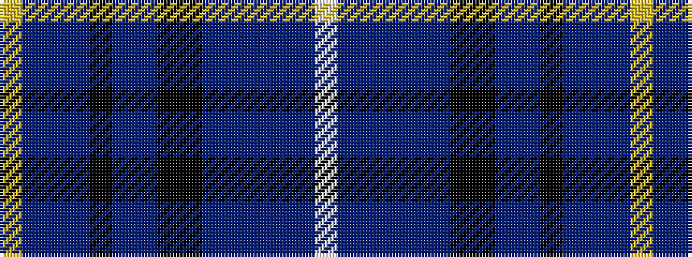

WBBBBBKKBBKBBBY

It is a 15 stripe tartan.

<figure class="pat-woven">

<figcaption>idealised sample</figcaption>
</figure>

## Colour Sequence



## Tartans with this colour sequence

| Tartans |
|---------------|
| [Northfield Academy Corporate Tartan](/variants/s15/lr2db1t2db2k1t12db2k1k10db28t1db3t2db3w1~x2/)|
||
