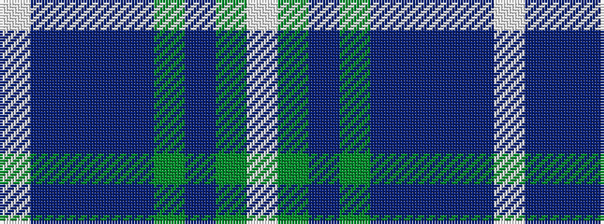

WBBBBGBGW

It is a 9 stripe tartan.

<figure class="pat-woven">

<figcaption>idealised sample</figcaption>
</figure>

## Colour Sequence



## Tartans with this colour sequence

| Tartans |
|---------------|
| [Sound of Iona](/variants/s9/w30t4db6dp4db6g6db12g13lb4~x2/)|
||
