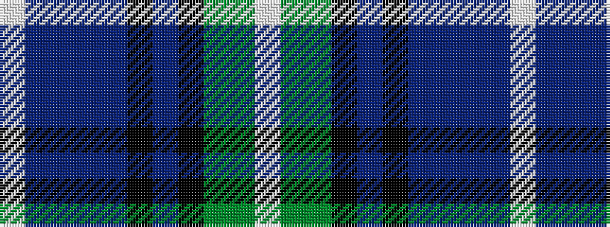

WBBBBKBKGGW

It is a 11 stripe tartan.

<figure class="pat-woven">

<figcaption>idealised sample</figcaption>
</figure>

## Colour Sequence



## Tartans with this colour sequence

| Tartans |
|---------------|
| [Carnegie of Skibo (Corporate)](/variants/s11/w3db5t2db9dp10k2dp5k2dg8g29w2~x2/)|
||
| [Inverclyde, Green (Corporate)](/variants/s11/w3db5b2db9dp10k2dp4k2gi10g33w2~x2/)|
||
