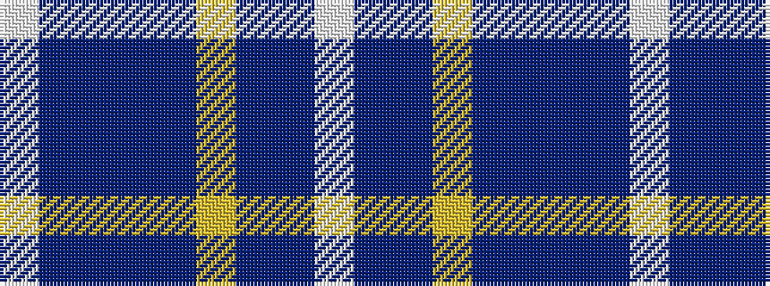

WBBBBYBBW

It is a 9 stripe tartan.

<figure class="pat-woven">

<figcaption>idealised sample</figcaption>
</figure>

## Colour Sequence



## Tartans with this colour sequence

| Tartans |
|---------------|
| [Caitriot](/setts/s9/w3t2n14lr8t14db16n13t2w3~x2/)|
||
