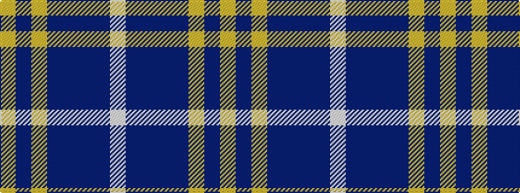

WBBBBYBY

It is a 8 stripe tartan.

<figure class="pat-woven">

<figcaption>idealised sample</figcaption>
</figure>

## Colour Sequence



## Tartans with this colour sequence

| Tartans |
|---------------|
| [Highlands School (N. Carolina) Corporate Tartan](/variants/s8/ly12dbi2ly2dbi30db3dbi2db13w4~x2/)|
||
| [Highlands School (North Carolina)](/variants/s8/lo12db2lo2db30dt2db2dt13lb4~x2/)|
||
