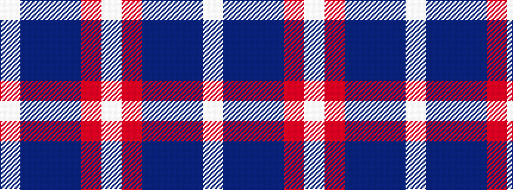

WBBBRW

It is a 6 stripe tartan.

<figure class="pat-woven">

<figcaption>idealised sample</figcaption>
</figure>

## Colour Sequence



## Tartans with this colour sequence

| Tartans |
|---------------|
| [Open Championship (1998)](/variants/s6/lb2db20n2dt15r9lb2~x2/)|
||
