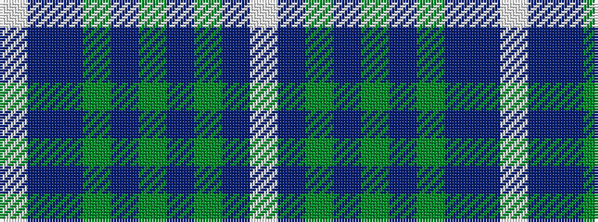

WBBGBGBGBW

It is a 10 stripe tartan.

<figure class="pat-woven">

<figcaption>idealised sample</figcaption>
</figure>

## Colour Sequence



## Tartans with this colour sequence

| Tartans |
|---------------|
| [Sverker](/variants/s10/w2n4dy3dt3dy3dt20dy3n16dt8lt2~x2/)|
||
