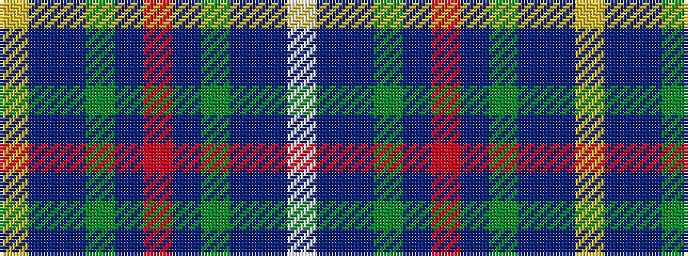

WBBGBRBGBBY

It is a 11 stripe tartan.

<figure class="pat-woven">

<figcaption>idealised sample</figcaption>
</figure>

## Colour Sequence



## Tartans with this colour sequence

| Tartans |
|---------------|
| [Carinthian National](/setts/s11/w3dt16do15dg18do3r3do3dg18do15dt16ly3~x2/)|
||
