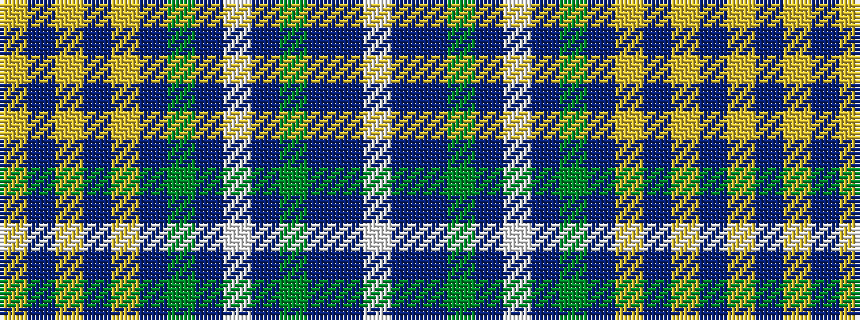

WBBGBWBGBYBYBY

It is a 14 stripe tartan.

<figure class="pat-woven">

<figcaption>idealised sample</figcaption>
</figure>

## Colour Sequence



## Tartans with this colour sequence

| Tartans |
|---------------|
| [State Seal of Oklahoma (Fashion)](/setts/s14/lo4do23lo4do4lo10do5g5do4lb4do4g5b32do1lb4~x2/)|
||
