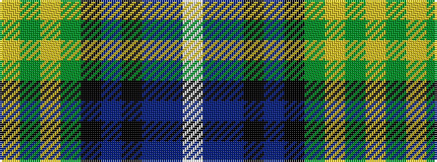

WBBKBKGYGY

It is a 10 stripe tartan.

<figure class="pat-woven">

<figcaption>idealised sample</figcaption>
</figure>

## Colour Sequence



## Tartans with this colour sequence

| Tartans |
|---------------|
| [Pinewoods Jubilee](/variants/s10/w3b38t2k4dp4k4g30ly1g1ly2~x2/)|
||
