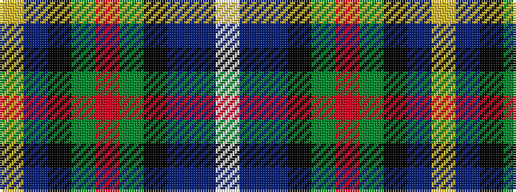

WBBKGRGKBY

It is a 10 stripe tartan.

<figure class="pat-woven">

<figcaption>idealised sample</figcaption>
</figure>

## Colour Sequence



## Tartans with this colour sequence

| Tartans |
|---------------|
| [Erskine Veterans](/setts/s10/w2b1db14k14dg14r2dg14k14db14ly2~x2/)|
||
| [Erskine Veterans (Corporate)](/setts/s10/w2t1db14k14dg14r2dg14k14db14ly2~x2/)|
||
