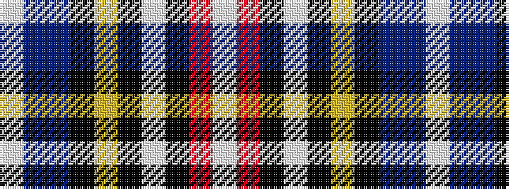

WBBKYKWKRW

It is a 10 stripe tartan.

<figure class="pat-woven">

<figcaption>idealised sample</figcaption>
</figure>

## Colour Sequence



## Tartans with this colour sequence

| Tartans |
|---------------|
| [Bruce of Kinnaird Dress (Dance)](/setts/s10/w45r9k2w8k2ly1k10db8dp12w2~x2/)|
||
