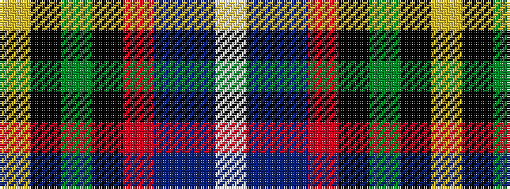

WBBRKGKY

It is a 8 stripe tartan.

<figure class="pat-woven">

<figcaption>idealised sample</figcaption>
</figure>

## Colour Sequence



## Tartans with this colour sequence

| Tartans |
|---------------|
| [Fujitsu](/variants/s8/w1db6dp9r12k12g32k6ly1~x2/)|
||
