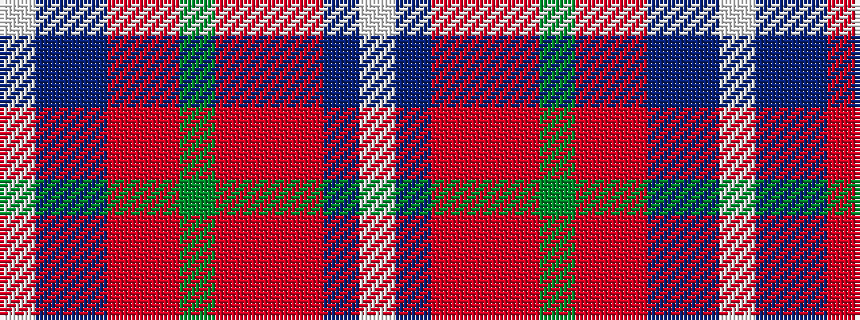

WBBRRGRRRBW

It is a 11 stripe tartan.

<figure class="pat-woven">

<figcaption>idealised sample</figcaption>
</figure>

## Colour Sequence



## Tartans with this colour sequence

| Tartans |
|---------------|
| [Moray of Abercairny](/setts/s11/w1t3db2ri18r2g16r2ri2r2t3w1~x2/)|
||
