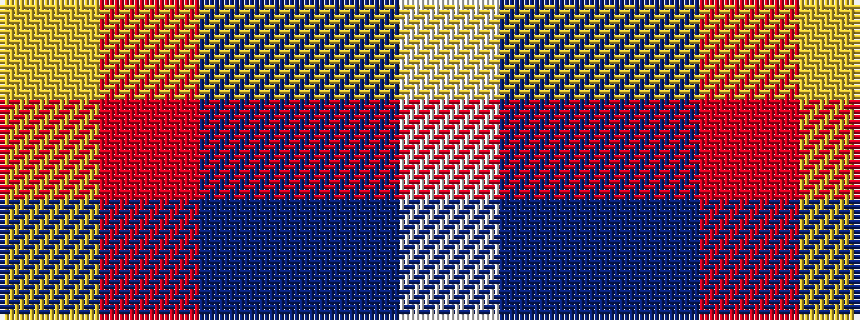

WBBRY

It is a 5 stripe tartan.

<figure class="pat-woven">

<figcaption>idealised sample</figcaption>
</figure>

## Colour Sequence



## Tartans with this colour sequence

| Tartans |
|---------------|
| [Bryson (1988) (Name)](/setts/s5/lr2r1t7db7lb1~x8/)|
||
