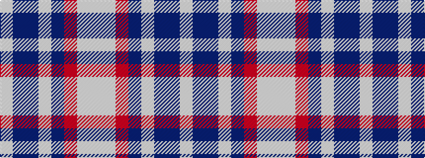

WBBWBRWW

It is a 8 stripe tartan.

<figure class="pat-woven">

<figcaption>idealised sample</figcaption>
</figure>

## Colour Sequence



## Tartans with this colour sequence

| Tartans |
|---------------|
| [Virginia International Tattoo Hixon](/variants/s8/lbi8db10t69w6t6r8lb19lbi3/)|
||
