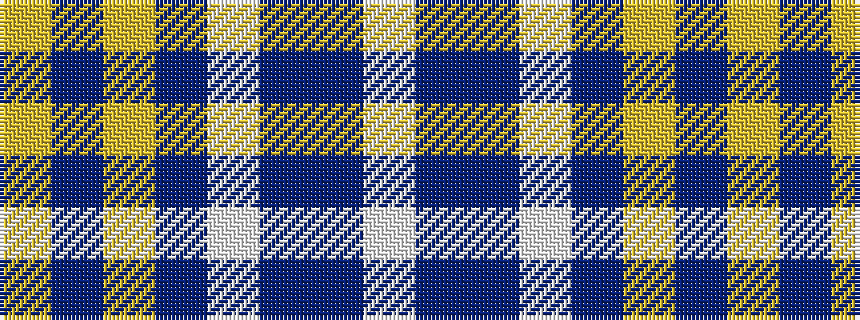

WBBWBYBY

It is a 8 stripe tartan.

<figure class="pat-woven">

<figcaption>idealised sample</figcaption>
</figure>

## Colour Sequence



## Tartans with this colour sequence

| Tartans |
|---------------|
| [Monaghan County Crest (Fashion)](/setts/s8/lo15db2lr8dbi21w2db21dbi6w7~x2/)|
||
