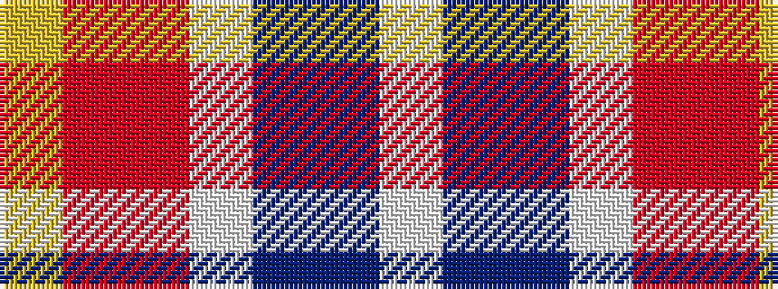

WBBWRRY

It is a 7 stripe tartan.

<figure class="pat-woven">

<figcaption>idealised sample</figcaption>
</figure>

## Colour Sequence



## Tartans with this colour sequence

| Tartans |
|---------------|
| [Isle of Jura](/setts/s7/lb18t18db10w3o15oi3ly8~x2/)|
||
