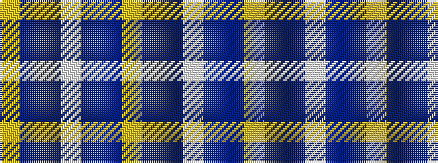

WBBYBBWBBY

It is a 10 stripe tartan.

<figure class="pat-woven">

<figcaption>idealised sample</figcaption>
</figure>

## Colour Sequence



## Tartans with this colour sequence

| Tartans |
|---------------|
| [Westwood MacSky (Fashion)](/variants/s10/w2db13dbi13ly2dbi13db13w2db6dbi6ly1~x2/)|
||
