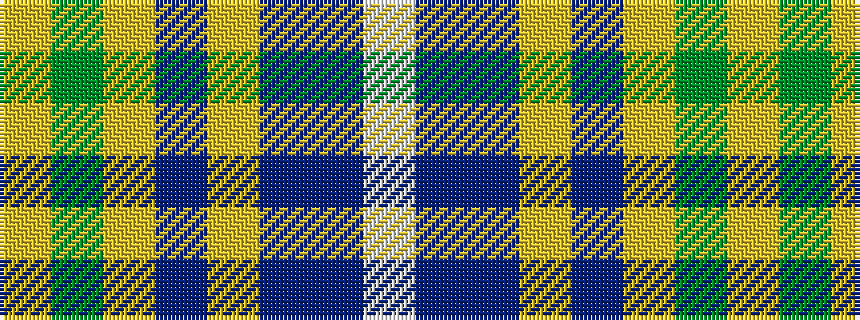

WBBYBYGY

It is a 8 stripe tartan.

<figure class="pat-woven">

<figcaption>idealised sample</figcaption>
</figure>

## Colour Sequence



## Tartans with this colour sequence

| Tartans |
|---------------|
| [Waterford County Crest (Fashion)](/variants/s8/w8dbi5db30lr4dbi13lr13g5lo5~x2/)|
||
