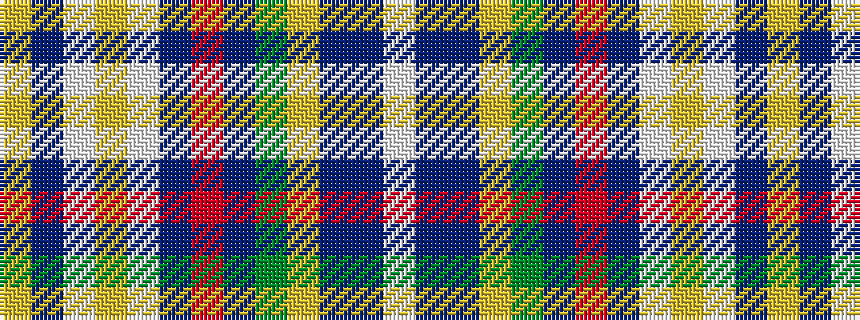

WBBYGBRBWYWBY

It is a 13 stripe tartan.

<figure class="pat-woven">

<figcaption>idealised sample</figcaption>
</figure>

## Colour Sequence



## Tartans with this colour sequence

| Tartans |
|---------------|
| [Kerr of Ardgowan Arisaid (Personal)](/setts/s13/ly2t1w42lo2w6dp1r1dp1g4lo4dp1t1w1~x2/)|
||
