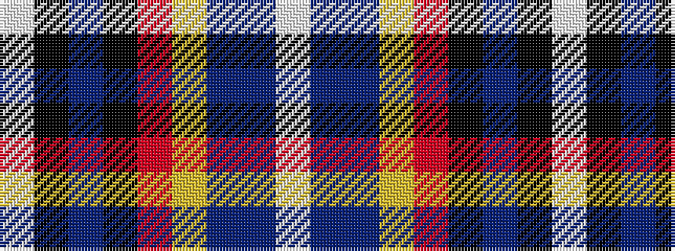

WBBYRKBKW

It is a 9 stripe tartan.

<figure class="pat-woven">

<figcaption>idealised sample</figcaption>
</figure>

## Colour Sequence



## Tartans with this colour sequence

| Tartans |
|---------------|
| [Wiegratz Alba (Personal)](/setts/s9/w3k2t30k5r5ly5t5db12w1~x2/)|
||
