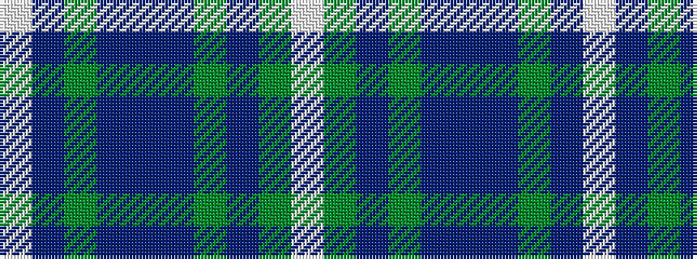

WBGBBBGBGW

It is a 10 stripe tartan.

<figure class="pat-woven">

<figcaption>idealised sample</figcaption>
</figure>

## Colour Sequence



## Tartans with this colour sequence

| Tartans |
|---------------|
| [Glen Tilt #1](/variants/s10/lb1dr1g1dr11db6dr1g14dr1g1lb1~x4/)|
||
